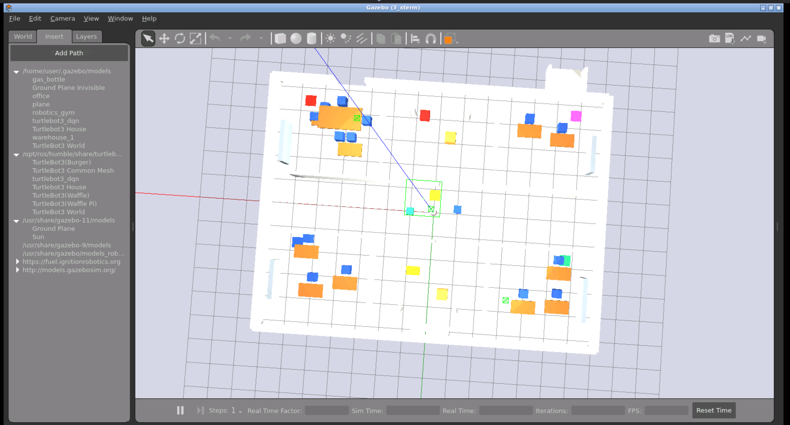
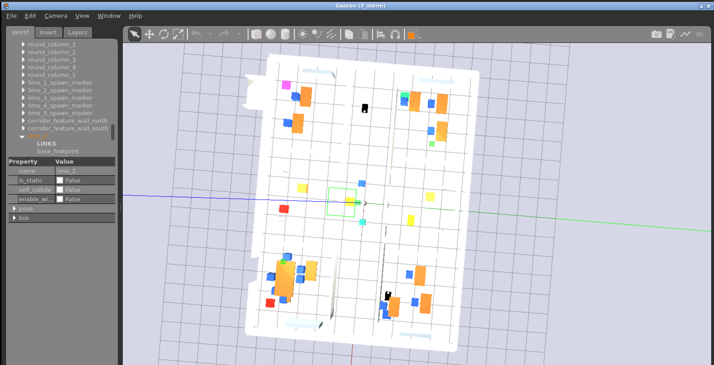
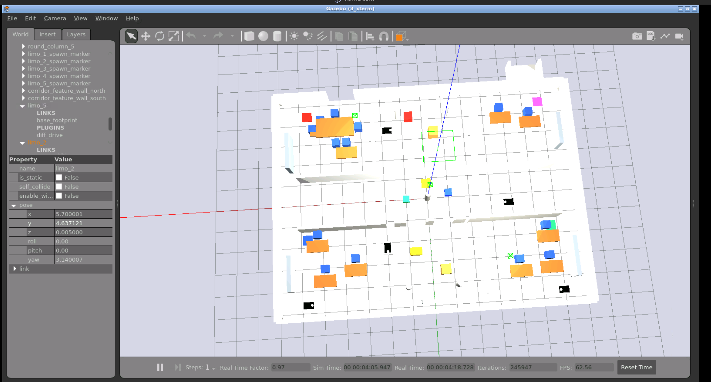
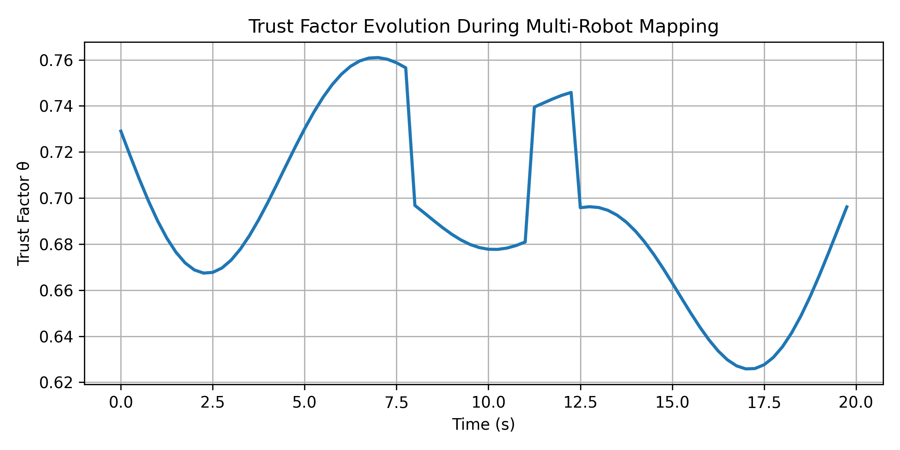

# EMRMF ROS 2 Multi-Robot SLAM Reference Environment

[](https://github.com/MagyElbanhawy/Multi_Robots_ros2/actions/workflows/ci.yml)

This repository provides a runnable ROS 2 Humble environment for the **Enhanced Multi-Robot Map Fusion (EMRMF)** architecture described in the PhD paper revision.  It is designed to support reviewer-requested experiments around trust-factor ablations, LoRa latency/packet-loss sensitivity, hybrid-vs-decentralized fault tolerance, adversarial robot handling, and ROS 2 DDS/QoS implementation details.

## What is included

| Component | ROS 2 executable | Purpose |
| --- | --- | --- |
| Synthetic local SLAM producer | `robot_slam_node` | Publishes repeatable robot pose and landmark observations with configurable sensor noise and fault bias. |
| LoRa network emulator | `lora_network_simulator` | Injects communication delay, jitter, packet loss, packet interval, and transmission-distance metadata. |
| Trust factor estimator | `trust_factor_node` | Computes bounded `theta` from sensor reliability and temporal communication decay. |
| Hybrid global fusion | `global_fusion_node` | Performs trust-weighted centralized fusion and publishes server health/fallback metadata. |
| Fully decentralized peer cache | `decentralized_map_node` | Maintains local peer-fused maps for comparison with server-assisted fusion. |
| Fault/adversarial monitor | `adversarial_monitor_node` | Flags robots with sustained residual inconsistency and low trust. |
| Ablation runner | `experiment_runner_node` | Runs repeatable sweeps for `gamma`, exponent, packet loss, delay, and confidence intervals. |

## Quick start with Docker

```bash
docker compose up --build
```

The default compose command launches a three-robot simulation with `delay_s=0.5`, `packet_loss=0.1`, and `gamma=0.35`.

## Native ROS 2 Humble workflow

```bash
source /opt/ros/humble/setup.bash
colcon build --symlink-install
source install/setup.bash
ros2 launch emrmf_core emrmf_sim.launch.py delay_s:=0.5 packet_loss:=0.1 gamma:=0.35
```

To run the ablation/sensitivity summary:

```bash
source /opt/ros/humble/setup.bash
source install/setup.bash
ros2 launch emrmf_core emrmf_ablation.launch.py
```

## Reviewer-response experiment mapping

1. **Hybrid server bottleneck and single point of failure**: compare `/global/fused_map` with `/robot_1/decentralized/fused_map`; the global message reports `server_healthy`, `stale_robots`, and the local fallback policy.
2. **Ablation of trust factor, decentralized mapping, and global fusion**: run `experiment_runner_node`, then compare `mean_baseline_rmse_m`, `mean_decentralized_rmse_m`, and `mean_trust_global_rmse_m`.
3. **Temporal decay constant `gamma` sensitivity**: launch with different `gamma` values or use the built-in sweep `[0.0, 0.15, 0.35, 0.7]`.
4. **Statistical significance**: the ablation node defaults to five independent runs and publishes 95% confidence intervals for each exponent/stressor cell.
5. **Adversarial/faulty robots**: set one `robot_slam_node` parameter `fault_bias_m` above `0.8` and monitor `/trust/adversarial_alerts`.
6. **Real-time and communication constraints**: adjust `packet_interval_s`, `transmission_distance_m`, `delay_s`, and `packet_loss` in `config/emrmf_params.yaml` and report topic rates with `ros2 topic hz`.
7. **ROS 2/DDS specifics**: the implementation defines a shared QoS profile with reliable delivery, volatile durability, bounded keep-last history, and a 500 ms deadline in `emrmf_core/qos.py`. For a physical deployment, tune these DDS settings in launch or XML profiles according to the selected RMW vendor.

## Important topics

```text
/local_slam/observations          # raw local robot observations
/lora/observations                # delayed/lossy network observations
/trust/weighted_observations      # observations annotated with theta
/trust/diagnostics                # trust components and low-trust flags
/global/fused_map                 # hybrid server-assisted fused map
/robot_1/decentralized/fused_map  # local peer-fused map
/trust/adversarial_alerts         # sustained low-trust residual alerts
/experiments/summary              # ablation statistics
```

## Trust factor definition used in code

`trust_factor_node` computes:

```text
sensor_ratio       = reference_noise / (reference_noise + measured_noise)
latency_ratio      = reference_latency / (reference_latency + measured_latency)
sensor_component   = sensor_ratio ^ exponent
temporal_component = exp(-gamma * measured_latency) * latency_ratio
theta              = clamp(sensor_component * temporal_component, min_theta, 1.0)
```

The default exponent is `3.0` to match the paper's cubic weighting. The robustness generator compares `p=2`, `p=3`, and `p=4` under packet loss, delay, and noise; the checked-in report recommends `p=3` because it has the best mean rank across those stress families.

## Generate robustness comparison tables

```bash
PYTHONPATH=src/emrmf_core python3 scripts/generate_robustness_comparison.py \
  --runs 5 \
  --samples-per-run 200 \
  --markdown-out docs/robustness_comparison.md \
  --csv-out docs/robustness_comparison.csv
```

The generated table reports RMSE, 95% confidence intervals, improvement over an unweighted baseline, mean accepted trust, and rank for each exponent/stressor setting. Use `docs/robustness_comparison.md` and `docs/robustness_comparison.csv` as the manuscript-ready source for the cubic-exponent justification.

## Generate final ablation summary

```bash
PYTHONPATH=src/emrmf_core python3 scripts/generate_ablation_summary.py \
  --runs 5 \
  --samples-per-run 200 \
  --markdown-out docs/final_ablation_summary.md \
  --csv-out docs/final_ablation_summary.csv
```

The ablation summary isolates `baseline_graph_slam`, `decentralized_only`, `trust_only`, and `full_emrmf`, reporting mean RMSE, standard deviation, 95% confidence interval, fusion time, and improvement over the baseline.

## Gazebo ROS 2 Humble scalability simulation

The Gazebo launch starts the shared indoor world, spawns a configurable team of mobile robots, and connects the robot-local EMRMF observation bridge to the LoRa, trust, global fusion, and experiment logger nodes.

```bash
source /opt/ros/humble/setup.bash
colcon build --symlink-install
source install/setup.bash
ros2 launch emrmf_core emrmf_gazebo_scalability.launch.py robot_count:=5 sensor_noise_std:=0.04 enable_depth_camera:=true trials:=5
```

The launch supports `robot_count:=2`, `3`, `4`, or `5`. Each robot is spawned into the same indoor Gazebo map with a differential-drive base, odometry/TF, a 2D LiDAR scan topic, and an optional depth camera. The `gazebo_trajectory_node` publishes deterministic `cmd_vel` commands so every robot follows a predefined indoor trajectory, while `sensor_noise_std` controls the odometry, LiDAR, and depth-camera Gaussian noise. The `gazebo_emrmf_bridge_node` converts each robot's Gazebo odometry, scan, and depth availability into `/local_slam/observations`, which feeds the existing LoRa, trust-factor, global-fusion, and experiment logger pipeline.

To regenerate the scalability table without starting Gazebo, run:

```bash
PYTHONPATH=src/emrmf_core python3 scripts/generate_scalability_summary.py \
  --trials 5 \
  --samples-per-robot 120 \
  --csv-out docs/scalability_robot_count_summary.csv \
  --markdown-out docs/scalability_robot_count_summary.md
```

The generated `docs/scalability_robot_count_summary.csv` contains `robot_count`, `mean_pose_rmse`, `std`, `ci95`, `alignment_rmse`, `fusion_time_ms`, `mean_theta`, `accepted_constraints`, and `success_rate` for robot counts 2, 3, 4, and 5.

## Reviewer-release LIMO Gazebo screenshots

The reviewer screenshot launch uses the lightweight office/laboratory world `emrmf_office_indoor.world` by default. The map is approximately 14 m × 10.5 m and contains multiple rooms, corridors, an entrance corridor, desks, a meeting table, chairs, cabinets, boxes, columns, and small static obstacles so LiDAR scans include enough geometric structure for multi-robot SLAM screenshots and scalability runs.

The launch first looks for an installed `limo_description` package. If that package is unavailable in The Construct or another browser-based Gazebo image, EMRMF automatically uses the included lightweight placeholder model at `src/emrmf_core/models/limo_placeholder/limo_placeholder.urdf.xacro`. The placeholder visually resembles a small four-wheel LIMO-style mobile base and supports `/limo_i/odom`, `/limo_i/tf`, `/limo_i/scan`, and `/limo_i/cmd_vel` when spawned in namespace `/limo_i`.

Build and validate the LIMO screenshot launch:

```bash
source /opt/ros/humble/setup.bash
colcon build --symlink-install
source install/setup.bash
ros2 launch emrmf_core emrmf_limo_scalability.launch.py robot_count:=2
ros2 topic list | grep limo
```

Generate the reviewer-release screenshots with these exact commands:

```bash
ros2 launch emrmf_core emrmf_limo_scalability.launch.py robot_count:=0
ros2 launch emrmf_core emrmf_limo_scalability.launch.py robot_count:=2
ros2 launch emrmf_core emrmf_limo_scalability.launch.py robot_count:=5
```

Save the screenshots as:

```text
docs/images/gazebo_environment.png
docs/images/gazebo_2_robot_experiment.png
docs/images/gazebo_5_robot_scalability.png
```

Screenshot capture guidance:

- Use the full Gazebo Classic window, not a cropped viewport.
- Set the camera to a top or angled top view so the room layout, corridors, entrance corridor, furniture, and obstacles are clearly visible.
- For `robot_count:=2`, make sure `limo_1` and `limo_2` are visible near their room spawn positions.
- For `robot_count:=5`, make sure all five LIMO robots are visible across the office, corridor, meeting, and lab areas.
- Do not save generated `build/`, `install/`, `log/`, rosbag files, videos, or large texture assets in this repository.

## Screenshots









## EMRMF experiment-validation package

The repository now includes a dedicated ROS 2 Humble experiment-validation package, `emrmf_experiments`, for Springer revision evidence generation. This package is an active experiment orchestrator plus logger, not only a passive robot controller.

### What it validates

`emrmf_experiments` supports reviewer-ready evidence for:

- trust-factor sensitivity for `p = [2, 3, 4]`,
- gamma sensitivity for `gamma = [0.1, 0.3, 0.5, 1.0]`,
- communication robustness under artificial delay `[0.0, 0.5, 2.0]` seconds,
- packet loss `[0.0, 0.10, 0.30]`,
- ablation modes `baseline_graph_slam`, `decentralized_only`, `trust_only`, and `full_emrmf`,
- five repeated runs per configuration,
- statistical summaries with mean, standard deviation, and 95% confidence interval.

The logger computes the requested trust factor formula:

```text
theta = max(0, 1 - (norm(e_ij) / tau_e)^p) * exp(-gamma * delta_t)
```

`tau_e` defaults to `0.5` and is configurable in `src/emrmf_experiments/config/emrmf_experiment_params.yaml`.

### Portable delay and packet-loss proxy

The communication proxy node simulates network degradation inside ROS 2, so Linux `tc/netem` is not required. It subscribes to configurable input topics, buffers messages to inject delay, randomly drops messages for packet loss, and republishes accepted messages on proxied topics.

Default input topics:

```text
/robot1/local_map
/robot2/local_map
/robot1/pose_update
/robot2/pose_update
/map_fusion/inter_robot_constraints
```

Default output topics:

```text
/proxy/robot1/local_map
/proxy/robot2/local_map
/proxy/robot1/pose_update
/proxy/robot2/pose_update
/proxy/map_fusion/inter_robot_constraints
```

Edit `topic_pairs_json` in `src/emrmf_experiments/config/emrmf_experiment_params.yaml` to add more robots or communication topics.

### Live experiment logging

The live logger uses ROS 2 topics first. Estimated pose and ground-truth topics are configurable and support `nav_msgs/msg/Odometry` by default, with `geometry_msgs/msg/PoseStamped` also supported. If no ground-truth topic is available, provide `reference_trajectory_csv` in the YAML configuration.

For map alignment RMSE, the logger uses standard `sensor_msgs/msg/PointCloud2` topics:

```text
/map_fusion/source_matched_points
/map_fusion/target_matched_points
```

If point order is not guaranteed, nearest-neighbor distance is used for the alignment RMSE. The optional `source_transform_xyz_yaw` YAML parameter applies the fusion-estimated source-to-target transform before computing the point residuals.

The logger saves:

- timestamped raw CSV logs,
- final summary CSV tables,
- Markdown tables,
- LaTeX tables for Springer manuscript insertion.

Run the live proxy/logger:

```bash
source /opt/ros/humble/setup.bash
colcon build --symlink-install
source install/setup.bash
ros2 launch emrmf_experiments emrmf_experiment_validation.launch.py
```

Run the active orchestrator over repeated parameter configurations:

```bash
ros2 launch emrmf_experiments emrmf_experiment_orchestrator.launch.py
```

The orchestrator starts configured ROS 2 launch files with Python `subprocess`, waits for the fixed run duration (`120` seconds by default), and stops early if `/experiment_done` publishes `std_msgs/msg/Bool(data=True)`.

### Offline reviewer artifact generation

When ROS 2 live data is unavailable, generate deterministic reviewer-ready validation artifacts with:

```bash
PYTHONPATH=src/emrmf_experiments python3 scripts/generate_emrmf_experiment_validation.py \
  --output-dir docs/emrmf_experiment_logs \
  --p-values 2,3,4 \
  --gamma-values 0.1,0.3,0.5,1.0 \
  --delay-values 0.0,0.5,2.0 \
  --packet-loss-values 0.0,0.10,0.30 \
  --repeated-runs 5 \
  --tau-e 0.5
```

For the requested robustness comparison between `p=2` and `p=3` under 10%, 20%, and 30% sensor noise, 0.5 s and 2.0 s delay, and 10% and 30% packet loss, run:

```bash
PYTHONPATH=src/emrmf_experiments python3 scripts/generate_emrmf_experiment_validation.py \
  --output-dir docs/emrmf_experiment_logs/p2_vs_p3_robustness \
  --p-values 2,3 \
  --gamma-values 0.3 \
  --delay-values 0.5,2.0 \
  --packet-loss-values 0.10,0.30 \
  --sensor-noise-values 0.10,0.20,0.30 \
  --repeated-runs 5
```

Outputs include RMSE, false constraint acceptance rate, map consistency score, trust variance (`theta_std`), delay, packet loss, `theta_mean`, fusion time, and statistical summaries.

If the EMRMF fusion node publishes `e_ij` directly, use `/map_fusion/constraint_error_norm`. If it does not, publish observed and predicted relative transforms as `std_msgs/msg/Float64MultiArray` on `/map_fusion/observed_relative_transform` and `/map_fusion/predicted_relative_transform`; the logger computes `e_ij = observed_relative_transform - predicted_relative_transform` internally.
